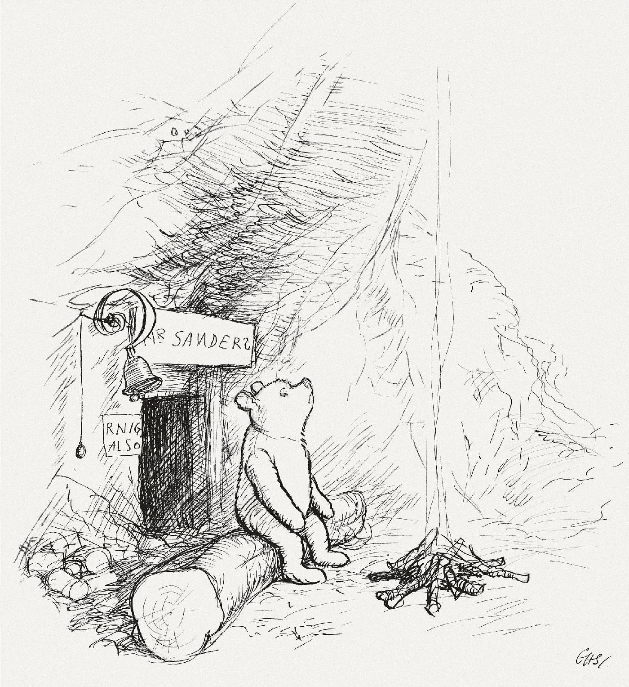

.. Accelerate documentation master file, created by
   sphinx-quickstart on Thu Jan 16 15:50:30 2025.
   You can adapt this file completely to your liking, but it should at least
   contain the root `toctree` directive.

User Guide
==========

Here we will describe how to use the tool.

By E. H. Shepard - Illustration to page 3 of Winnie-the-Pooh (1926) by artist E. H. Shepard. Scan from Bibliodyssey, PD-US, https://en.wikipedia.org/w/index.php?curid=34771447

Some needs

.. req:: Lane Marking Detection Algorithm
   :id: R_001
   :status: open

   Develop software to process camera inputs and accurately identify lane markings under various environmental conditions.

.. req:: Lane Deviation Warning
   :id: R_002
   :status: open

   Implement a feature to trigger warnings if the vehicle deviates from its lane without proper signaling.

.. needtable:: Requirement table
   :types: req
   :columns: id;title;implements

.. needtable:: Architecture table
   :types: arch
   :columns: id;title;links